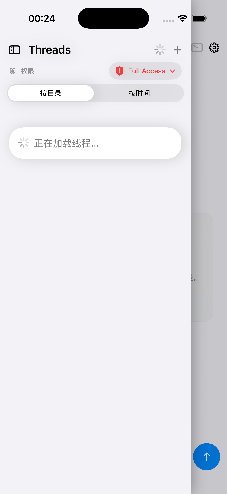

<p align="right">
  <b>Language</b>:
  <a href="#english">English</a> |
  <a href="#chinese">中文</a>
</p>

---

<a id="english"></a>

<details open>
<summary><b>🇺🇸 English Documentation</b>（click to collapse）</summary>

<br>

# OpenCodex

> Run an AI coding assistant on your iPhone — real-time chat, terminal access, file browsing, and command approval in one app.

[](https://github.com/mjmkk/opencodex/actions/workflows/ci.yml)
[](https://codecov.io/gh/mjmkk/opencodex)
[](LICENSE)
[](https://swift.org)
[](https://nodejs.org)

## Overview

OpenCodex is an **iOS client + local Node.js Worker backend** development platform.
Connect your iPhone to a Worker service running on your Mac to engage in multi-turn conversations with Claude / Codex, view execution logs, approve high-risk commands, browse and edit project files, and operate a remote terminal.

### Key Features

| Feature | Description |
|---------|-------------|
| 💬 Multi-thread Chat | Independent context per thread, with archive & switch support |
| ⚡ Real-time Streaming | SSE event stream with batch processing to prevent UI lag (24 events / 80ms) |
| ✅ Command Approval | Pauses dangerous commands for approve / reject / modify review |
| 🖥️ Split-screen Terminal | WebSocket terminal with auto-reconnect and PTY resize |
| 📁 File Browser | Tree view, full-text search, code viewing & editing |
| 🔗 Message Links | Tap `path:line` references in messages to jump directly to the file |

### Screenshots



## Architecture Overview

```
iPhone App (SwiftUI + TCA)
├── AppFeature          ← Global lifecycle & connection management
├── ThreadsFeature      ← Thread list
├── ChatFeature         ← Real-time chat (SSE)
├── TerminalFeature     ← Split-screen terminal (WebSocket)
├── FileBrowserFeature  ← File tree & search
├── ApprovalFeature     ← Approval sheet
└── SettingsFeature     ← Connection configuration

Mac Worker (Node.js)
└── codex-worker-mvp    ← REST + SSE + WebSocket → codex app-server
```

**Communication Protocols**

| Use Case | Protocol | Notes |
|----------|----------|-------|
| Thread / job management | REST HTTP | Standard CRUD |
| Real-time message stream | SSE | Cursor-based, auto-recovery on disconnect |
| Terminal interaction | WebSocket | Frame sequence numbers, ping/pong keepalive |

## Repository Layout

```
OpenCodex/
├── CodexWorkerApp/          # Xcode wrapper project (App entry point)
├── codex-worker-ios/        # Swift Package (business logic & UI)
│   └── Sources/CodexWorker/
│       ├── App/             # Root app entry
│       ├── Features/        # TCA Reducer feature modules
│       ├── Models/          # Data models
│       ├── Dependencies/    # TCA dependencies (API/SSE/Terminal/Store)
│       └── Services/        # Markdown rendering, message pipeline, etc.
├── codex-worker-mvp/        # Node.js Worker backend
├── codex-sessions-tool/     # Session backup / restore CLI tool
└── docs/                    # Design docs & architecture decisions
```

## Prerequisites

- **macOS** — to run the Worker backend and Xcode
- **Xcode 16+** — to build the iOS App (Swift 6 required)
- **Node.js ≥ 22** — to run the Worker backend
- **codex CLI** — Worker calls `codex app-server` internally (API Key must be configured)
- **iPhone or iOS Simulator** (iOS 17+)

## Runtime Dependency Boundary

- This repository fully includes:
  - `codex-worker-ios` (iOS package)
  - `codex-worker-mvp` (Node.js worker)
  - `codex-sessions-tool` (session utility)
- This repository does **not** include `codex app-server` implementation.
  - Runtime depends on local `codex` CLI availability and account permission.
  - Without `codex app-server` access, contributors can still run unit tests, static checks, and submit UI/state-machine/documentation improvements.

## Quick Start

### Option A — Docker (Recommended)

```bash
# 1. Clone and configure
git clone https://github.com/mjmkk/opencodex.git && cd opencodex
cp codex-worker-mvp/worker.config.example.json codex-worker-mvp/worker.config.json
# Edit worker.config.json — add your Codex/Claude API key

# 2. Start the backend
make docker-up          # builds image and starts in background

# 3. Verify
curl http://localhost:3000/v1/health
# → {"status":"ok"}
```

### Option B — Node.js (Development)

```bash
cd codex-worker-mvp
cp ../codex-worker-mvp/worker.config.example.json worker.config.json
npm install
npm start               # listens on http://127.0.0.1:3000
```

### Step 2: Run the iOS App

1. Open `CodexWorkerApp/CodexWorkerApp/CodexWorkerApp.xcodeproj` in Xcode
2. Select the `CodexWorkerApp` scheme → choose a simulator or your iPhone → **Run**
3. In the App **Settings**, set the connection URL:
   - Simulator: `http://127.0.0.1:3000`
   - Physical iPhone: `http://<Mac-LAN-IP>:3000` (same Wi-Fi network required)

> **Full deployment guide** → [docs/deployment.md](docs/deployment.md)

## Common Commands

### Backend Tests

```bash
cd codex-worker-mvp && npm test
```

### iOS Package Unit Tests

```bash
cd codex-worker-ios
xcodebuild -scheme CodexWorker \
  -destination 'platform=iOS Simulator,name=iPhone 16 Pro' test
```

### iOS App Build Verification

```bash
cd CodexWorkerApp/CodexWorkerApp
xcodebuild -project CodexWorkerApp.xcodeproj \
  -scheme CodexWorkerApp \
  -configuration Debug \
  -destination 'generic/platform=iOS Simulator' \
  -skipMacroValidation \
  build
```

### Session Backup & Restore

```bash
cd codex-sessions-tool
npm install

# Backup
node bin/backup.js --output ./backup.tar.gz

# Restore
node bin/restore.js --input ./backup.tar.gz

# Verify
node bin/verify.js --input ./backup.tar.gz

# Health check
node bin/doctor.js
```

## Configuration Reference

| Item | Location | Notes |
|------|----------|-------|
| iOS connection config | App Settings → `UserDefaults` | Base URL, Token, model preference |
| Worker port | `PORT` env var | Default `8787` |
| Worker auth token | `WORKER_TOKEN` env var | Leave empty to disable auth |
| SQLite database | `codex-worker-mvp/data/worker.db` | Created automatically |

For full backend configuration options, see [`codex-worker-mvp/README.md`](codex-worker-mvp/README.md).

## Tech Stack

**iOS Frontend**

| Library | Purpose |
|---------|---------|
| [ComposableArchitecture](https://github.com/pointfreeco/swift-composable-architecture) | State management (TCA) |
| [ExyteChat](https://github.com/exyte/Chat) | Chat UI component |
| [GRDB](https://github.com/groue/GRDB.swift) | SQLite ORM (local cache) |
| [SwiftTerm](https://github.com/migueldeicaza/SwiftTerm) | Terminal rendering |
| [Runestone](https://github.com/simonbs/Runestone) | Code editor |
| [MarkdownUI](https://github.com/gonzalezreal/swift-markdown-ui) | Markdown rendering |
| [EventSource](https://github.com/inlineapps/ios-eventsource) | SSE client |

**Node.js Backend**

| Technology | Purpose |
|------------|---------|
| Express | HTTP server framework |
| SQLite (better-sqlite3) | Data persistence |
| WebSocket (ws) | Terminal stream transport |
| SSE | Message event push |

## License

This repository is licensed under the [Apache License 2.0](LICENSE).

- See [NOTICE](NOTICE) for attribution notice.
- Vendored third-party code keeps its original license (for example, `swift-composable-architecture/` has its own `LICENSE`).

## Development Guidelines

- Before committing, run at minimum: backend `npm test` and iOS `xcodebuild ... build`
- Swift code uses `StrictConcurrency` — all async code must be concurrency-safe
- All network-layer logging uses `OSLog Logger` (with per-module categories), never `print()`
- TCA `Effect` side effects follow structured concurrency; all cancellable tasks use explicit `CancelID`s

</details>

---

<a id="chinese"></a>

<details>
<summary><b>🇨🇳 中文文档</b>（点击展开）</summary>

<br>

# OpenCodex

> 在 iPhone 上运行 AI 编程助手 —— 实时对话、终端操作、文件浏览、命令审批，一体化体验。

## 简介

OpenCodex 是一个 **iOS 客户端 + 本地 Node.js Worker 后端**的研发平台。
通过 iPhone 连接运行在 Mac 上的 Worker 服务，即可使用 Claude / Codex 进行多轮对话、查看执行日志、审批高危命令、浏览和编辑项目文件，以及操作远端终端。

### 核心功能

| 功能 | 说明 |
|------|------|
| 💬 多线程对话 | 每个线程独立上下文，支持归档与切换 |
| ⚡ 实时流式输出 | SSE 事件流，批处理防卡顿（24 条/80ms） |
| ✅ 命令审批 | 高危命令暂停执行，支持批准 / 拒绝 / 修改 |
| 🖥️ 半屏终端 | WebSocket 实时终端，自动重连，PTY resize |
| 📁 文件浏览 | 树形目录、全文搜索、代码查看与编辑 |
| 🔗 消息跳转 | 点击消息中的 `path:line` 引用直接跳转到文件 |

### 截图预览


## 架构概览

```
iPhone App (SwiftUI + TCA)
├── AppFeature          ← 全局生命周期 & 连接管理
├── ThreadsFeature      ← 线程列表
├── ChatFeature         ← 实时聊天（SSE）
├── TerminalFeature     ← 半屏终端（WebSocket）
├── FileBrowserFeature  ← 文件浏览树 & 搜索
├── ApprovalFeature     ← 审批弹层
└── SettingsFeature     ← 连接配置

Mac Worker (Node.js)
└── codex-worker-mvp    ← REST + SSE + WebSocket → codex app-server
```

**通信协议**

| 场景 | 协议 | 说明 |
|------|------|------|
| 线程 / 任务管理 | REST HTTP | 标准 CRUD |
| 实时消息流 | SSE | 事件序列号游标，断线自动恢复 |
| 终端交互 | WebSocket | 帧序列号，ping/pong 保活 |

## 目录结构

```
OpenCodex/
├── CodexWorkerApp/          # Xcode 壳工程（App 入口）
├── codex-worker-ios/        # Swift Package（业务逻辑与 UI）
│   └── Sources/CodexWorker/
│       ├── App/             # App 根入口
│       ├── Features/        # TCA Reducer 功能模块
│       ├── Models/          # 数据模型
│       ├── Dependencies/    # TCA 依赖注入（API/SSE/Terminal/Store）
│       └── Services/        # Markdown 渲染、消息管道等服务
├── codex-worker-mvp/        # Node.js Worker 后端
├── codex-sessions-tool/     # Session 备份 / 恢复 CLI 工具
└── docs/                    # 设计文档 & 架构决策
```

## 环境要求

- **macOS** — 运行 Worker 后端与 Xcode
- **Xcode 16+** — 编译 iOS App（需支持 Swift 6）
- **Node.js ≥ 22** — 运行 Worker 后端
- **codex CLI** — Worker 内部调用 `codex app-server`（需已配置 API Key）
- **iPhone 或 iOS 模拟器**（iOS 17+）

## 运行时依赖边界

- 本仓库完整开源并提供：
  - `codex-worker-ios`（iOS 侧）
  - `codex-worker-mvp`（Node.js Worker）
  - `codex-sessions-tool`（会话工具）
- 本仓库**不包含** `codex app-server` 的实现源码。
  - 运行时依赖本机 `codex` 命令和对应账号权限。
  - 即使没有 app-server 访问权限，贡献者仍可执行单元测试、静态检查，并提交 UI/状态机/文档改进。

## 快速启动

### 方式 A — Docker（推荐）

```bash
# 1. 克隆并配置
git clone https://github.com/mjmkk/opencodex.git && cd opencodex
cp codex-worker-mvp/worker.config.example.json codex-worker-mvp/worker.config.json
# 编辑 worker.config.json，填入 Codex/Claude API Key

# 2. 启动后端
make docker-up          # 自动构建镜像并在后台运行

# 3. 验证
curl http://localhost:3000/v1/health
# → {"status":"ok"}
```

### 方式 B — Node.js（开发调试）

```bash
cd codex-worker-mvp
cp ../codex-worker-mvp/worker.config.example.json worker.config.json
npm install
npm start               # 监听 http://127.0.0.1:3000
```

### 第二步：运行 iOS App

1. 用 Xcode 打开 `CodexWorkerApp/CodexWorkerApp/CodexWorkerApp.xcodeproj`
2. 选择 Scheme `CodexWorkerApp` → 选择模拟器或真机 → **运行**
3. 在 App **设置页**填写连接 URL：
   - 模拟器：`http://127.0.0.1:3000`
   - 真机：`http://<Mac局域网IP>:3000`（与 Mac 同一 Wi-Fi 网络）

> **完整部署指南** → [docs/deployment.md](docs/deployment.md)

## 常用命令

### 后端测试

```bash
cd codex-worker-mvp && npm test
```

### iOS 包单元测试

```bash
cd codex-worker-ios
xcodebuild -scheme CodexWorker \
  -destination 'platform=iOS Simulator,name=iPhone 16 Pro' test
```

### iOS App 构建校验

```bash
cd CodexWorkerApp/CodexWorkerApp
xcodebuild -project CodexWorkerApp.xcodeproj \
  -scheme CodexWorkerApp \
  -configuration Debug \
  -destination 'generic/platform=iOS Simulator' \
  -skipMacroValidation \
  build
```

### Session 备份与恢复

```bash
cd codex-sessions-tool
npm install

# 备份
node bin/backup.js --output ./backup.tar.gz

# 恢复
node bin/restore.js --input ./backup.tar.gz

# 验证
node bin/verify.js --input ./backup.tar.gz

# 环境体检
node bin/doctor.js
```

## 配置说明

| 项目 | 位置 | 说明 |
|------|------|------|
| iOS 连接配置 | App 设置页 → `UserDefaults` | Base URL、Token、模型偏好 |
| Worker 端口 | `PORT` 环境变量 | 默认 `8787` |
| Worker 鉴权 Token | `WORKER_TOKEN` 环境变量 | 留空则不鉴权 |
| SQLite 数据库 | `codex-worker-mvp/data/worker.db` | 自动创建 |

详细后端配置见 [`codex-worker-mvp/README.md`](codex-worker-mvp/README.md)。

## 技术栈

**iOS 前端**

| 库 | 用途 |
|----|------|
| [ComposableArchitecture](https://github.com/pointfreeco/swift-composable-architecture) | 状态管理（TCA） |
| [ExyteChat](https://github.com/exyte/Chat) | 聊天 UI 组件 |
| [GRDB](https://github.com/groue/GRDB.swift) | SQLite ORM（本地缓存） |
| [SwiftTerm](https://github.com/migueldeicaza/SwiftTerm) | 终端渲染 |
| [Runestone](https://github.com/simonbs/Runestone) | 代码编辑器 |
| [MarkdownUI](https://github.com/gonzalezreal/swift-markdown-ui) | Markdown 渲染 |
| [EventSource](https://github.com/inlineapps/ios-eventsource) | SSE 客户端 |

**Node.js 后端**

| 技术 | 用途 |
|------|------|
| Express | HTTP 服务框架 |
| SQLite (better-sqlite3) | 数据持久化 |
| WebSocket (ws) | 终端流传输 |
| SSE | 消息事件推送 |

## 许可证

本仓库采用 [Apache License 2.0](LICENSE)。

- 归属声明见 [NOTICE](NOTICE)。
- 仓库内保留的第三方代码沿用其原始许可证（例如 `swift-composable-architecture/` 目录下自带 `LICENSE`）。

## 开发约定

- 提交前请至少执行后端 `npm test` 和 iOS `xcodebuild ... build`
- Swift 代码启用了 `StrictConcurrency`，确保并发安全
- 所有网络层日志使用 `OSLog Logger`（category 区分模块），不使用 `print()`
- TCA `Effect` 副作用遵循结构化并发，cancellable 任务均设置明确的 `CancelID`

</details>
