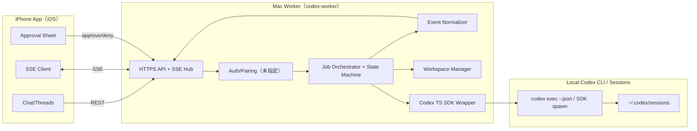
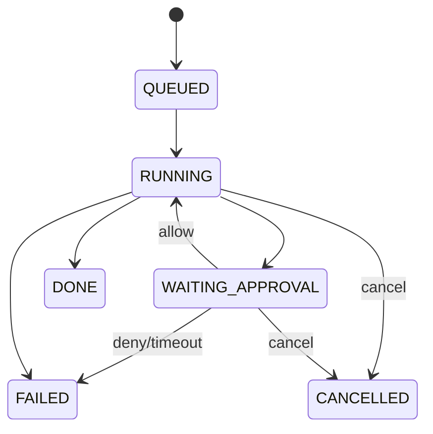
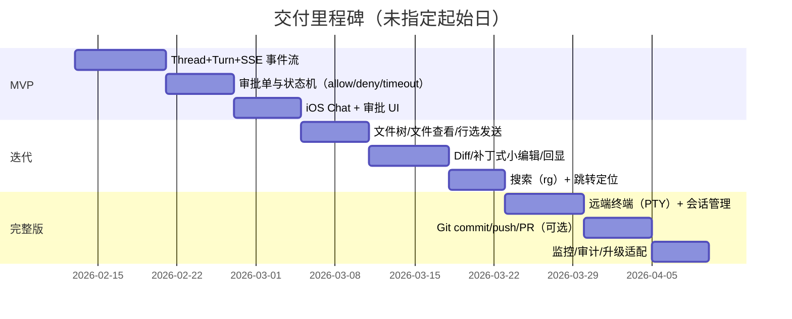

# iPhone 作为 Codex 前端、Mac 作为 Codex Worker 的可执行方案

## Executive Summary
本方案在 Mac 上运行 `codex-worker`（Node/TS 常驻服务），通过 Codex TypeScript SDK 控制本地 Codex：SDK 会 spawn `codex` CLI，并用 stdin/stdout 交换 JSONL 事件；`runStreamed()` 提供结构化中间事件流，适合做“实时进度 + 审批”。iPhone 端在 MVP 只做 UI（对话/审批/线程切换），通过 HTTPS API + SSE 订阅 job 事件；审批以“审批单”回传 allow/deny。文件查看、diff、搜索、远端终端延后到后续迭代。CLI 的 `--json` 输出提供稳定的 JSONL 事件（含 `thread.started`、`turn.*`、`item.*`、`error` 等），可作为 Worker 的可观测基础。线程会话可落盘并从 `~/.codex/sessions` 恢复；Codex 状态默认在 `CODEX_HOME`（默认 `~/.codex`）。

## 系统架构与组件清单


组件清单（最小可交付）  
| 组件 | 责任 | 实现要点 |
|---|---|---|
| iOS App | 对话、线程切换、审批（MVP） | SSE 重连、消息流渲染、审批单弹窗与回传 |
| `codex-worker` API | MVP 6~8 个端点；SSE 事件流；断线续传 | 事件 append-only 存储 + cursor |
| Job Orchestrator | 任务编排、状态机、超时/取消 | “一个 turn → 一个 job” |
| Codex Adapter | 调用 SDK：`startThread/resumeThread/runStreamed` | SDK spawn CLI、JSONL 事件流 |
| Workspace/Git | 每 job 隔离目录（MVP）；diff/commit/PR（后续） | Codex 默认要求 cwd 为 Git repo（可跳过检查） |
| Config/State | `CODEX_HOME`、`--config` 覆盖、日志路径 | `CODEX_HOME` 默认 `~/.codex` |

## API 轮廓
约束：MVP 仅保留“聊天 + 批复”必需端点；所有写操作返回 `jobId`，细节走 SSE。

| 方法 | 路径 | 说明 |
|---|---|---|
| POST | `/v1/threads` | 新建 thread（绑定项目与 cwd） |
| GET | `/v1/threads` | list threads（可按 pid 过滤） |
| POST | `/v1/threads/{tid}/turns` | 发送消息并启动 job（内部 `runStreamed`） |
| GET | `/v1/jobs/{jid}` | job 状态快照 |
| GET | `/v1/jobs/{jid}/events` | SSE：事件流（cursor） |
| POST | `/v1/jobs/{jid}/approve` | 批复审批单 |
| POST | `/v1/jobs/{jid}/cancel` | 取消 job |

> 非 MVP（后续迭代）：`/tree`、`/file`、`/search`、`/diff`、`/edit`、`/terminals/*`

示例：启动一个 turn（创建 job）
```bash
curl -sS -X POST http://mac.local:8787/v1/threads/thr_123/turns \
  -H 'Authorization: Bearer <token>' \
  -H 'Content-Type: application/json' \
  -d '{
    "input":[{"type":"text","text":"运行 lint 并总结失败原因"}]
  }'
# -> {"jobId":"job_01H...","state":"RUNNING"}
```

示例：订阅 SSE（断线续传）
```bash
curl -N http://mac.local:8787/v1/jobs/job_01H.../events?cursor=0 \
  -H 'Authorization: Bearer <token>'
```

示例：批准审批单
```bash
curl -sS -X POST http://mac.local:8787/v1/jobs/job_01H.../approve \
  -H 'Authorization: Bearer <token>' -H 'Content-Type: application/json' \
  -d '{"approvalId":"appr_123","decision":"allow","scope":"once"}'
```

Node/TS 伪代码（事件规范化：把 Codex JSONL 转成 MVP 8 种事件）
```ts
import { Codex } from "@openai/codex-sdk";

const codex = new Codex(); // Node 18+ 要求见 SDK README
const thread = codex.startThread({ workingDirectory: "/repo" });

async function runTurn(jobId: string, input: any[]) {
  const { events } = await thread.runStreamed(input);
  for await (const ev of events) {
    // ev.type: item.completed / turn.completed / ...
    publishSSE(jobId, normalize(ev));
  }
}
```
（SDK 通过 spawn CLI 并交换 JSONL；`run()` 缓冲到结束、`runStreamed()` 提供结构化中间事件。）

iOS（Swift）示例：发起 turn + 订阅 SSE（伪代码）
```swift
func startTurn(threadId: String, text: String) async throws -> String {
  var req = URLRequest(url: URL(string:"http://mac.local:8787/v1/threads/\(threadId)/turns")!)
  req.httpMethod = "POST"
  req.addValue("Bearer \(token)", forHTTPHeaderField: "Authorization")
  req.addValue("application/json", forHTTPHeaderField: "Content-Type")
  req.httpBody = try JSONEncoder().encode(["input":[["type":"text","text":text]]])
  let (data, _) = try await URLSession.shared.data(for: req)
  return (try JSONSerialization.jsonObject(with: data) as! [String:Any])["jobId"] as! String
}
```

## 事件协议、审批单与 Schema
设计目标：iOS 永远只依赖你的稳定事件；Worker 内部可随 Codex 升级而适配。CLI `--json` 明确 stdout 为 JSONL 事件流，事件类型包含 `thread.started`、`turn.*`、`item.*`、`error`。Codex 富客户端遵循 item 生命周期（started → 可选 delta → completed），且审批会“暂停 turn 直到客户端回应”。

事件种类（MVP ≤10）：  
`job.created`、`job.state`、`turn.started`、`item.started`、`item.delta`、`item.completed`、`approval.required`、`job.finished`

事件 Envelope JSON Schema（可复制）
```json
{
  "$id": "https://example.local/schemas/event.json",
  "type": "object",
  "required": ["type", "ts", "jobId", "seq", "payload"],
  "properties": {
    "type": { "type": "string", "enum": [
      "job.created","job.state","turn.started",
      "item.started","item.delta","item.completed",
      "approval.required","job.finished"
    ]},
    "ts": { "type": "string", "format": "date-time" },
    "jobId": { "type": "string" },
    "seq": { "type": "integer", "minimum": 0 },
    "payload": { "type": "object" }
  },
  "additionalProperties": false
}
```

审批单 Schema（独立对象，可存库/审计）
```json
{
  "$id": "https://example.local/schemas/approval.json",
  "type": "object",
  "required": ["approvalId","jobId","riskLevel","action","createdAt","expiresAt"],
  "properties": {
    "approvalId": { "type": "string" },
    "jobId": { "type": "string" },
    "riskLevel": { "type": "string", "enum": ["SAFE","RISKY","EXTERNAL"] },
    "reason": { "type": "string" },
    "action": {
      "type": "object",
      "required": ["kind","preview","cwd"],
      "properties": {
        "kind": { "type": "string", "enum": ["command","write_file","network","git_push"] },
        "preview": { "type": "string" },
        "cwd": { "type": "string" },
        "affectedPaths": { "type": "array", "items": { "type": "string" } }
      },
      "additionalProperties": false
    },
    "options": {
      "type": "array",
      "items": { "type": "string", "enum": ["allow_once","allow_session","deny"] }
    },
    "createdAt": { "type": "string", "format": "date-time" },
    "expiresAt": { "type": "string", "format": "date-time" }
  },
  "additionalProperties": false
}
```

## Job 状态机与 Workspace/Git 策略
Codex `exec` 默认只读沙箱；需要编辑可用 `--full-auto`；更高权限（如 `danger-full-access`）仅建议在隔离环境使用。



Workspace 策略（默认）  
- 目录：`/workspaces/{jobId}/{repoClone}` + `/artifacts`（日志/diff/结构化输出）。  
- 每 job 独立 Git 分支：`codex/job_{jobId}`；默认只生成 diff；`commit/push/PR` 走 EXTERNAL 审批（未指定 Git 平台）。  
- Codex 默认要求 `workingDirectory` 是 Git repo；必要时可 `skipGitRepoCheck`（仅用于只读/非 Git 项目）。  
- 线程恢复：记录 `threadId`；需要时 `resumeThread(threadId)`；会话落在 `~/.codex/sessions`。  

配置与可重复性  
- `CODEX_HOME` 默认 `~/.codex`；用 `--config` 或 SDK `config` 注入 key（TOML 字面量）来透传运行参数；权限相关策略由 Codex 自身执行。

## 安全策略与部署选项
安全策略（最小集）  
- 权限边界由 Codex 自身保证（沙箱、审批暂停与执行模式）；Worker 不重复实现路径/命令 allowlist。  
- 平台只做鉴权、审批流转与审计留痕，不在业务层“限制死”访问权限。  
- `--config`/SDK `config` 仅用于透传运行参数与环境，不额外定义一套权限系统。  
- 审计：所有审批单与决策写入不可变日志（append-only），与 job 事件共享 cursor。  
- 版本固定：Codex/SDK 频繁发布且修复行为差异（如 `resumeThread()` 变更），建议锁定版本并提供升级适配层。  

部署选项对比  
| 方案 | 网络暴露 | 推荐鉴权 | 适用 |
|---|---|---|---|
| Mac 本地 | 仅 `127.0.0.1`（iOS 需隧道，未指定） | 设备侧隧道 + 本地 token | 个人试用 |
| 内网 | LAN 监听 + mDNS 发现（未指定） | mTLS 或设备配对一次性码 | 家/办公室 |
| 公网 | 反代 + TLS | mTLS + 短时 JWT；IP 限制 | 跨网访问 |

可选增强：若未来需要更“原生 Codex 客户端协议”（JSON-RPC/双向请求、服务端主动发起审批请求），可评估 `codex app-server`；其协议同样走 stdio JSONL，且支持生成 TS/JSON Schema 绑定。

## 里程碑与验收、估时、测试、运维、风险


开发任务分解与估时（人日，代码难度假设“可写”）  
说明：下表为完整版；MVP 只需 `Mac API + SSE`、`Codex Adapter`、`Job/Approval`、`iOS Chat`、`iOS Approval` 与最小运维。  
| 模块 | 人日 | 验收要点 |
|---|---:|---|
| Mac：API + SSE Hub + cursor | 6 | 断线重连不丢事件 |
| Mac：Codex Adapter（SDK） | 4 | `runStreamed`→规范化事件 |
| Mac：Job/Approval 状态机 | 6 | WAITING_APPROVAL 可恢复 |
| Mac：Workspace/Git/diff | 6 | 每 job 隔离、diff 准确 |
| Mac：Search（rg） | 3 | 返回命中行+上下文 |
| iOS：Threads/Projects/Chat | 6 | 切换不串上下文 |
| iOS：Files/Diff/Search Viewer | 8 | 不换行+缩放+选行 |
| iOS：Approval/Terminal UI | 7 | 审批可追溯；终端不卡顿 |
| 运维/监控/日志/打包 | 4 | 基础指标与告警 |
| 合计 | 50 | 未指定并行与人员配置 |

测试与验收用例（节选）  
- 断网 30 秒后重连：SSE 从 `cursor` 继续，job 状态正确（不得重复执行）。  
- 审批拒绝：命令/写文件不发生，job 进入 FAILED/CANCELLED，产出可读错误摘要。  
- 并发：两个 job 同时运行，workspace/diff/事件不串。  
- 权限链路：Worker 不做路径/命令拦截，审批请求与决策日志可回放；实际权限由 Codex 执行策略保证。  

运维与监控要点  
- 指标：`job_duration`、`approval_wait_time`、`active_sse_connections`、`codex_exit_code_rate`、`workspace_disk_usage`。  
- 日志：事件 append-only（seq）、审批审计、Codex 原始 JSONL（便于回放/升级适配）。  
- 版本：锁定 `@openai/codex` 与 `@openai/codex-sdk`；升级前用 changelog 回归关键流（线程恢复/事件字段）。  

主要风险与缓解  
- 事件/字段随版本漂移 → Worker 增“规范化层 + 兼容测试”，并提供 schema 版本号。  
- 公网暴露导致 RCE 风险 → 默认内网；公网必须 mTLS/短时 token/审批审计（未指定实现细节）。  
- 日志洪水导致 iOS 卡顿 → Worker 端节流聚合（按 200ms/按行数），iOS 增量渲染。  
- Workspace 磁盘膨胀 → TTL 清理、配额、artifact 压缩归档（未指定阈值）。  
- 审批体验不清晰 → 审批单必须包含 `preview/cwd/affectedPaths/riskLevel`，并在 UI 展示“将执行什么”。
