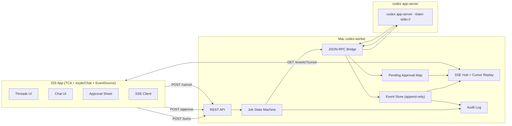
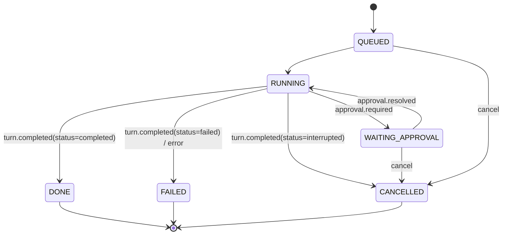
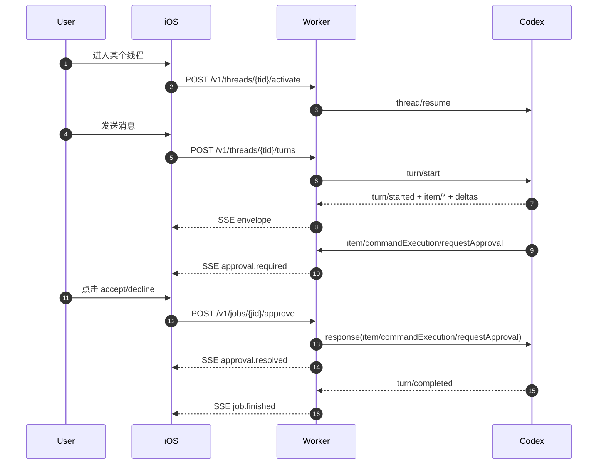

# iPhone 作为前端、Mac 作为 Worker 的 Codex 客户端架构（可点击审批版本）

> 关键结论：如果 iPhone 端必须“可点击审批并回传”，则不能只用 `@openai/codex-sdk` 的 `run/runStreamed` 路径；必须走 OpenAI 官方 `codex app-server` 双向 JSON-RPC 协议。
>
> 因此本文档以 OpenAI 官方 `codex app-server` 协议与 schema 为实现基线；`@openai/codex-sdk` 仅作为非审批场景参考。

## 0. 术语说明

- `TS SDK-only`：仅使用 `@openai/codex-sdk` 的 `Codex.startThread()/thread.run()/thread.runStreamed()` 与其 JSON 事件流，不接入 `codex app-server` 的 server->client request 通道。
- `官方优先`：本方案全部使用 OpenAI 官方能力。审批走官方 `codex app-server`，非审批场景可继续使用官方 `@openai/codex-sdk`。
- `Project`（本项目定义）：Worker 维护的“可用工作目录（cwd）”抽象，不是 Codex 官方协议里的一等实体。
- `Thread`（官方实体）：会话实体，携带 `id`，并记录该线程绑定的 `cwd`。

## 1. 目标与边界

### 1.1 MVP 目标（必须交付）
- iOS：线程列表/切换、对话消息流、审批弹窗与回传、任务终态展示。
- Mac Worker：
  - 对接 `codex app-server`（stdio JSON-RPC）。
  - 向 iOS 暴露 REST + SSE（cursor 续流）。
  - 维护 Job 状态机与审批幂等。
  - 审计落盘与事件回放。
- 成功标准：
  - 用户可完成“发消息 -> 收到审批 -> 在 iPhone 点击 -> 任务继续/终止”的闭环。
  - SSE 断线后按 `cursor` 续流，不重跑任务。
  - 审批决策与关键状态变化可审计、可回放。

### 1.2 非 MVP（延后）
- 文件树/搜索面板。
- 远端终端会话透传 UI。
- Git push/PR 自动化流程编排。

### 1.3 Project/Thread 的 MVP 决策
- `Thread`：MVP 必须支持“创建 + 选择”。这是官方主工作流（`thread/start`、`thread/resume`、`thread/list`）。
  - 选择语义：从列表选中后，前端默认显式调用 `activate`，Worker 执行 `thread/resume`。
  - 兜底语义：`POST /v1/threads/{tid}/turns` 内部必须“先确保已加载再 turn/start”；若未加载，Worker 自动懒 `resume`。
  - 设计结论：两条路径并存且不冲突。前端走显式 `activate`（状态清晰），Worker 保留懒 `resume`（容错兜底）。
- `Project`：MVP 需要支持“选择”，不需要“创建”。
  - 选择：创建线程时选择 `projectPath`（映射到 `thread/start.cwd`）。
  - 创建：新建目录/初始化 git 仓库属于宿主文件系统能力，不属于 Codex 协议能力，MVP 不做。

## 2. 事实基线（官方协议）

以下能力均来自本地官方仓库 `openai/codex`：
- `codex app-server` 是面向富客户端的官方接口，支持双向 JSON-RPC。默认 `stdio` 传输。
- 审批是 server->client request：
  - `item/commandExecution/requestApproval`
  - `item/fileChange/requestApproval`
- turn 生命周期与事件：
  - `turn/start`
  - `turn/interrupt`
  - `turn/started`
  - `turn/completed`
  - `item/started`
  - `item/completed`
  - `item/agentMessage/delta`
- `Thread` 对象包含 `cwd`（工作目录）；协议中没有独立 `Project` API/实体。

对应参考：
- `/Users/Apple/Dev/OpenCodex/codex/codex-rs/app-server/README.md`
- `/Users/Apple/Dev/OpenCodex/codex/codex-rs/app-server-protocol/src/protocol/common.rs`
- `/Users/Apple/Dev/OpenCodex/codex/codex-rs/app-server-protocol/schema/typescript/v2`
- `/Users/Apple/Dev/OpenCodex/codex/sdk/typescript`

## 3. 本地参考仓库路径映射

| 角色 | 仓库 | 本地路径 | 优先参考入口 |
|---|---|---|---|
| iOS 状态管理 | pointfreeco/swift-composable-architecture | `/Users/Apple/Dev/OpenCodex/swift-composable-architecture` | `/Users/Apple/Dev/OpenCodex/swift-composable-architecture/Sources` |
| iOS 聊天 UI | exyte/Chat | `/Users/Apple/Dev/OpenCodex/Chat` | `/Users/Apple/Dev/OpenCodex/Chat/Sources` |
| iOS SSE 客户端 | Recouse/EventSource | `/Users/Apple/Dev/OpenCodex/EventSource` | `/Users/Apple/Dev/OpenCodex/EventSource/Sources/EventSource` |
| 官方协议基线 | openai/codex | `/Users/Apple/Dev/OpenCodex/codex` | `/Users/Apple/Dev/OpenCodex/codex/codex-rs/app-server`、`/Users/Apple/Dev/OpenCodex/codex/codex-rs/app-server-protocol` |

## 4. 总览架构



## 5. Worker API 契约（MVP）

### 5.1 端点清单
- `GET /v1/projects` 列出可选项目（Worker 本地抽象，返回 `projectId + projectPath + displayName`，数据源来自 Worker 配置白名单，不做全盘扫描）。
- `POST /v1/threads` 创建线程。
- `GET /v1/threads` 查询线程列表。
- `POST /v1/threads/{tid}/activate` 激活（选择）线程，内部映射 `thread/resume`。
- `POST /v1/threads/{tid}/fork` 分支线程，复制历史记录创建新线程。
- `POST /v1/threads/{tid}/archive` 归档线程。
- `POST /v1/threads/{tid}/unarchive` 取消归档线程。
- `POST /v1/threads/{tid}/review` 启动代码审查。
- `POST /v1/threads/{tid}/turns` 发消息并创建 job。
- `GET /v1/jobs/{jid}` 查询 job 快照。
- `GET /v1/jobs/{jid}/events?cursor=N` 订阅 SSE。
- `POST /v1/jobs/{jid}/approve` 提交审批决策。
- `POST /v1/jobs/{jid}/cancel` 取消运行中的 turn/job。
- `GET /v1/skills` 列出可用技能。
- `POST /v1/skills` 列出可用技能（带参数）。
- `GET /v1/apps` 列出可用应用。
- `POST /v1/apps` 列出可用应用（带参数）。

### 5.1.1 创建线程请求体（建议）
```json
{
  "projectId": "proj_xxx",
  "projectPath": "/Users/me/project",
  "threadName": "可选"
}
```

约束：
- `projectId` 与 `projectPath` 二选一，最终都映射为 `thread/start.cwd`。
- 都不传时使用 Worker 默认项目目录（单项目模式）。
- `projectPath` 必须在 `GET /v1/projects` 返回的白名单内，否则拒绝请求。

### 5.1.2 线程激活语义（`POST /v1/threads/{tid}/activate`）
- 目的：把历史线程加载到当前 app-server 进程（映射 `thread/resume`）。
- 幂等：同一 `threadId` 重复激活应返回成功，不重复产生副作用。
- 前端策略：用户切换到某线程详情页时立即调用，确保“进入即就绪”。

### 5.1.3 发消息语义（`POST /v1/threads/{tid}/turns`）
- Worker 必须执行 `ensureThreadLoaded(threadId)`：
  - 已加载：直接 `turn/start`。
  - 未加载：先 `thread/resume`，成功后 `turn/start`。
- 结果保证：只要 `threadId` 合法且可恢复，`turns` 不应因"前端漏调 activate"而失败。

### 5.1.4 线程分支（`POST /v1/threads/{tid}/fork`）
- 目的：从现有线程创建分支，复制历史记录。
- 返回：新线程对象。
- 使用场景：想在不影响原线程的情况下探索不同方向。

### 5.1.5 线程归档（`POST /v1/threads/{tid}/archive` / `unarchive`）
- 归档：将线程移入归档目录，不在常规列表中显示。
- 取消归档：将归档线程恢复到常规列表。
- 使用场景：清理已完成或不再需要的线程。

### 5.1.6 代码审查（`POST /v1/threads/{tid}/review`）
请求体：
```json
{
  "target": {
    "type": "uncommittedChanges" | "baseBranch" | "commit" | "custom"
  },
  "delivery": "inline" | "detached"
}
```
- `uncommittedChanges`：审查未提交的更改。
- `baseBranch`：审查与指定分支的差异。
- `commit`：审查特定提交。
- `custom`：自定义审查指令。

### 5.1.7 技能和应用查询
- `GET/POST /v1/skills`：查询可用技能列表。
- `GET/POST /v1/apps`：查询可用应用列表。

### 5.2 iOS 侧审批请求体（Worker 对外）
```json
{
  "approvalId": "appr_xxx",
  "decision": "accept | accept_for_session | accept_with_execpolicy_amendment | decline | cancel",
  "execPolicyAmendment": ["git", "push"]
}
```

约束：
- `accept_with_execpolicy_amendment` 仅允许命令审批；文件变更审批不支持该决策。
- `decision=accept_with_execpolicy_amendment` 时必须传 `execPolicyAmendment` 且至少 1 个 token。
- 其余 `decision` 下忽略 `execPolicyAmendment`。
- `approvalId` 幂等：重复提交返回首次结果，不得重复影响状态。

### 5.3 与官方 JSON-RPC 的映射
- 线程激活：`thread/resume`
  - 用途：将历史线程加载到当前 app-server 进程，供后续 `turn/start` 使用。
- 发消息：`turn/start`
  - 前置约束：必须先满足“线程已加载”（通过显式 `activate` 或 `turns` 内懒 `resume`）。
- 命令审批请求：`item/commandExecution/requestApproval`
  - Worker 响应：`CommandExecutionRequestApprovalResponse`
  - 决策值：`accept | acceptForSession | {acceptWithExecpolicyAmendment} | decline | cancel`
- 文件变更审批请求：`item/fileChange/requestApproval`
  - Worker 响应：`FileChangeRequestApprovalResponse`
  - 决策值：`accept | acceptForSession | decline | cancel`

## 6. 协议稳定层（iOS 消费）

### 6.1 Envelope
```json
{
  "type": "job.created | job.state | thread.started | turn.started | item.started | item.completed | item.agentMessage.delta | item.commandExecution.outputDelta | item.fileChange.outputDelta | approval.required | approval.resolved | turn.completed | error | job.finished",
  "ts": "2026-02-12T16:00:00Z",
  "jobId": "job_xxx",
  "seq": 42,
  "payload": {}
}
```

### 6.2 Worker 内部审批对象（不直接下发 iOS）
```json
{
  "approvalId": "appr_xxx",
  "jobId": "job_xxx",
  "threadId": "thr_xxx",
  "turnId": "turn_xxx",
  "itemId": "item_xxx",
  "kind": "command_execution | file_change",
  "requestMethod": "item/commandExecution/requestApproval | item/fileChange/requestApproval",
  "requestId": 123,
  "createdAt": "2026-02-12T16:00:00Z",
  "command": "npm test",
  "cwd": "/repo",
  "commandActions": [],
  "reason": "optional",
  "changes": []
}
```

### 6.3 iOS 下发的审批事件对象
```json
{
  "approvalId": "appr_xxx",
  "jobId": "job_xxx",
  "threadId": "thr_xxx",
  "turnId": "turn_xxx",
  "itemId": "item_xxx",
  "kind": "command_execution | file_change",
  "requestMethod": "item/commandExecution/requestApproval | item/fileChange/requestApproval",
  "createdAt": "2026-02-12T16:00:00Z",
  "command": "npm test",
  "cwd": "/repo",
  "commandActions": [],
  "reason": "optional",
  "changes": []
}
```

说明：
- `requestId` 仅 Worker 内部持有，不下发给 iOS（避免客户端越权构造回包）。
- iOS 只基于 `approvalId` 交互。

## 7. Job 状态机（审批友好）



规则：
- 终态由 `turn/completed.status` 权威决定（`completed | failed | interrupted`）。
- `decline` 并不等价于 job 立刻失败；要等待后续 `turn/completed`。
- `cancel(jobId)` 幂等；终态上重复取消无副作用。

## 8. Worker 实现细节

### 8.1 JSON-RPC Bridge
- 启动子进程：`codex app-server`（默认 `stdio://`）。
- 启动线程时默认设置 `approvalPolicy=on-request`（否则不会进入审批请求链路）。
- 创建线程时将 Worker 的 `projectPath` 映射到 `thread/start.cwd`。
- 线程加载采用“双轨”：
  - 显式轨：前端切线程时调用 `POST /v1/threads/{tid}/activate`，Worker 执行 `thread/resume`。
  - 兜底轨：`POST /v1/threads/{tid}/turns` 内部自动懒 `resume`。
- `turn/start` 前必须保证线程已加载：
  - 若线程已加载：直接 `turn/start`。
  - 若线程未加载：先 `thread/resume`，成功后再 `turn/start`。
- 建立请求-响应路由：
  - client request：Worker->Codex（`thread/start`, `thread/list`, `thread/resume`, `turn/start`, `turn/interrupt`）
  - server request：Codex->Worker（审批请求）
  - notification：Codex->Worker（turn/item/delta）
- 初始化握手：`initialize` -> `initialized`。
- 注意：当前官方实现下，`turn/started` 与 `turn/completed` 的 `turn.items` 可能为空；前端必须以 `item/*` 事件流为权威。

### 8.2 审批映射器
- 收到审批请求时：
  - 生成 `approvalId`。
  - 建立 `approvalId -> (requestId, method, threadId, turnId, itemId)` 映射。
  - 发 `approval.required` 事件给 iOS。
- 收到 iOS `/approve` 时：
  - 查映射并校验 job/线程一致性。
  - 转换决策为官方 response payload 回写给 Codex。
  - 发 `approval.resolved` 事件。
  - 删除 pending 映射（幂等决策表保留）。

### 8.3 持久化最小结构
- `threads(threadId PK, codexThreadId, createdAt, updatedAt)`
- `jobs(jobId PK, threadId, turnId, state, createdAt, updatedAt, terminalAt, errorMessage?)`
- `job_events(jobId, seq, type, ts, payload_json, PRIMARY KEY(jobId, seq))`
- `approvals(approvalId PK, jobId, threadId, turnId, kind, request_method, request_id, createdAt, payload_json)`
- `approval_decisions(approvalId PK, decision, decidedAt, actor, extra_json)`

约束：
- `job_events` append-only。
- `approval_decisions.approvalId` 唯一约束作为幂等闸门。
- 审计覆盖：turn start、approval required/resolved、interrupt、turn completed、error。

### 8.4 鉴权与边界
- iOS->Worker：`Authorization: Bearer <token>`。
- Worker->Codex：本机进程内 stdio，不暴露公网口。
- 公网发布需在 Worker 外层加 TLS + 强鉴权。

## 9. SSE 与 cursor

- 单 job 内 `seq` 严格递增。
- iOS 重连携带 `cursor`，服务端回放 `seq > cursor`。
- 心跳：每 15 秒 `: ping`，不占用业务 `seq`。
- 游标过期：返回 `409 CURSOR_EXPIRED`，客户端先 `GET /v1/jobs/{jid}` 再重连。

## 10. iOS（TCA + exyte/Chat）

### 10.1 Feature 拆分
- `AppFeature`：鉴权、路由、全局连接管理。
- `ThreadsFeature`：线程列表、创建、切换。
- `ChatFeature`：turn 发送、消息流、任务状态。
- `SSEFeature`：连接/断线重连/cursor。
- `ApprovalFeature`：审批弹窗、accept/decline/cancel/accept_for_session。

### 10.2 关键 Reducer 逻辑
- `item/agentMessage/delta`：按 `itemId` 追加文本，实时刷新同一条 assistant 消息。
- `item/completed(agentMessage)`：标记该消息完成态。
- `approval.required`：写入 `pendingApproval` 并弹窗。
- `approval.resolved`：关闭弹窗，更新审批卡状态。
- `turn.completed`：依据 status 收敛 `DONE/FAILED/CANCELLED`。

### 10.3 UI 清单
- 线程列表与切换。
- 聊天消息流（delta 增量渲染）。
- 审批卡（命令/改动摘要 + 决策按钮）。
- 任务状态卡（RUNNING/WAITING_APPROVAL/DONE/FAILED/CANCELLED）。

## 11. 请求生命周期（含审批）



## 12. 测试与验收（强制）

1. 正常对话：`turn.completed(status=completed)`，job 收敛 DONE。
2. 命令审批 accept：任务继续并完成。
3. 命令审批 decline：命令项 `declined`，turn 最终状态正确收敛。
4. 文件审批 accept_for_session：后续同类审批按会话策略表现正确。
5. 审批 cancel：turn 最终 `interrupted` 或等价终态，job 收敛 CANCELLED。
6. 重复 `/approve`：命中幂等，结果稳定，无重复副作用。
7. `turn/interrupt` 取消：最终 `turn.completed(status=interrupted)`。
8. SSE 断线重连：按 cursor 续流，无丢失/乱序。
9. 并发 job：审批不串单（approvalId 与 jobId 强绑定）。
10. 审计完整性：可按 `jobId` 回放审批与终态。

## 13. ADR

- ADR-001：审批是产品核心能力，MVP 必须支持 iPhone 端点击决策。
- ADR-002：为支持审批闭环，协议基线采用官方 `codex app-server`，不采用 TS SDK-only 路径。
- ADR-003：iOS 不直接接 JSON-RPC；由 Worker 统一转 REST + SSE，降低移动端复杂度。
- ADR-004：turn 终态以 `turn/completed.status` 为准，避免把 `decline` 错判为立即失败。
- ADR-005：审批决策必须幂等并可审计回放。
