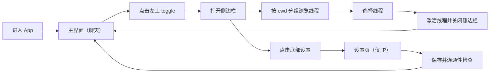
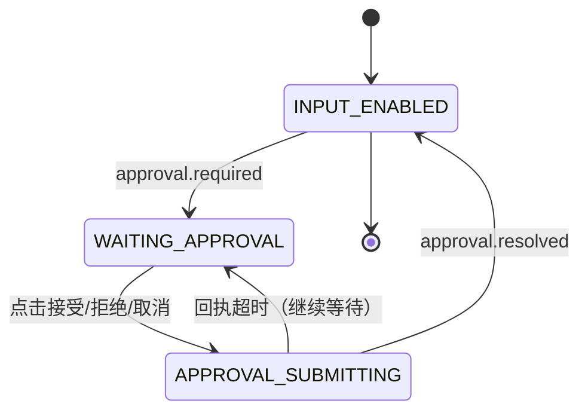

# iPhone 无缝衔接 Mac Codex 工作流（产品设计文档）

> 本文只讨论产品设计，不讨论商业化与营收。
>
> 使用者只有你本人，目标是“在 iPhone 上无缝衔接 Mac 上的 Codex 工作流”。

## English Summary

This product design document focuses on a single-user workflow continuity experience:

1. Continue Mac Codex sessions from iPhone without losing context.
2. Handle approvals quickly and safely on mobile.
3. Recover smoothly from network/background interruptions.
4. Define measurable MVP acceptance criteria for UX, not only engineering completeness.

## 0. 文档边界

### 0.1 这份文档负责什么
- 定义“无缝衔接”对你来说到底是什么意思。
- 设计 iPhone 侧核心交互流程与异常恢复流程。
- 给出可验收的体验标准，避免只做“工程可用”。

### 0.2 这份文档不负责什么
- 不讨论商业价值、团队协作、定价、增长。
- 不讨论多租户权限模型。
- 不替代技术架构文档（见 `/Users/Apple/Dev/OpenCodex/mvp-architecture.md`）。

## 1. 术语说明（先解释再使用）

- `MVP`（Minimum Viable Product，最小可行产品）：先交付最关键闭环，不追求一步到位。
- `UI`（User Interface，用户界面）：你在 iPhone 上看到和操作的界面。
- `SSE`（Server-Sent Events，服务端推送事件）：Worker 持续向 iPhone 推送任务事件的通道。
- `Thread`（会话线程）：一段连续对话上下文。
- `Job`（任务）：一次发消息后触发的执行过程。
- `Approval`（审批）：执行命令或改文件前，需要你确认的决策点。
- `Worker`：跑在 Mac 上、对接 `codex app-server` 的本地服务。

## 2. 产品目标（单用户版）

### 2.1 核心目标
- 你离开电脑后，拿起 iPhone 能继续刚才的线程，不丢上下文。
- 需要审批时，iPhone 能即时提示并一键回传；审批期间阻塞当前线程输入，避免状态错乱。
- 网络波动或 App 切后台后，回到前台能自动恢复进度，不重复执行。

### 2.2 “无缝衔接”的量化定义
- `继续速度`：打开 App 到可继续最近线程，目标在 10 秒内。
- `上下文连续`：iPhone 显示的最新消息与 Mac 端一致，不出现“看不到刚刚输出”。
- `恢复可靠性`：断线重连后不重复消费事件、不重复审批。

## 3. 用户场景（只围绕你）

### 3.1 场景 A：离开工位继续任务
- 你在 Mac 发起了一个耗时任务。
- 人离开工位，用 iPhone 观察进度并继续追问。
- 关键诉求：不用重新解释上下文。

### 3.2 场景 B：审批打断快速处理
- Worker 触发命令/文件变更审批。
- 你在 iPhone 上快速看摘要并决策。
- 关键诉求：风险看得懂、决策做得快。

### 3.3 场景 C：网络中断后恢复
- 电梯、地铁、Wi-Fi 切换导致连接断开。
- 回到可用网络后，任务流自动续上。
- 关键诉求：不中断任务心智，不需要手动补救。

## 4. 核心体验原则

- `连续优先`：默认进入“最近活跃线程”，减少选择成本。
- `状态透明`：你随时知道任务在运行、等待审批、已完成还是失败。
- `最小打断`：审批只展示决策必需信息，不塞无关细节。
- `可恢复`：任何失败都给“下一步动作”，不把你留在死胡同。
- `一处决策，全局一致`：同一个审批在任何界面只能看到一个权威状态。

## 5. 信息架构（iPhone）

### 5.1 一级结构
- `线程列表`：看所有会话、最近活跃、状态标记。
- `聊天详情`：消息流、任务状态、输入框。
- `审批层`：主界面底部审批弹窗（处理当前审批）+ 审批历史列表（查看最近结果）。

### 5.2 关键对象展示（按优先级）
- `Thread`：名字、最近一条消息、最后活跃时间、当前任务状态。
- `Job`：运行中/等待审批/完成/失败/取消。
- `Approval`：类型（命令/文件变更）、摘要、风险提示、决策按钮。

## 6. 核心流程设计

### 6.1 流程一：打开 App 后继续最近线程
1. 进入 App 自动定位最近活跃线程。
2. 自动触发线程激活（内部映射 `thread/resume`，你无感）。
3. 聊天页立即可输入，同时继续接收事件流。

成功标志：
- 你不需要手动找上下文。
- 最近消息和任务状态与 Mac 一致。

### 6.2 流程二：发送新消息并跟进结果
1. 你在当前线程输入并发送。
2. UI 先展示“任务已创建”占位状态。
3. 实时渲染增量输出（`delta` 文本流）。
4. 收到终态后收敛到完成/失败/取消。

成功标志：
- 输出是连续增长，不闪烁、不跳行。
- 终态明确，且可追溯到对应任务卡片。

### 6.3 流程三：审批闭环
1. 收到 `approval.required` 时在主界面底部弹出审批卡，并禁用当前线程输入区。
2. 卡片展示最小必要信息：
   - 命令审批：命令、工作目录、风险提示。
   - 文件审批：变更摘要、影响范围。
3. 你可选：接受、会话内接受、拒绝、取消。
4. 提交后立刻显示“已提交”，随后以事件结果更新最终状态。

成功标志：
- 审批不串单（不会把 A 任务的审批应用到 B 任务）。
- 重复点击不会造成重复副作用。

### 6.4 流程四：断线恢复
1. 连接断开时，顶部状态条提示“连接中断，正在重连”。
2. 自动携带游标（cursor）重连，回补缺失事件。
3. 若游标过期，自动拉一次任务快照后再重连事件流。

成功标志：
- 你不需要手动刷新。
- 不会因为重连导致重复消息或状态倒退。

## 7. 审批体验设计（重点）

### 7.1 审批卡片必须展示
- 审批类型（命令/文件变更）。
- 风险级别（低/中/高，基于规则判定）。
- 可读摘要（不要原样堆日志）。
- 决策按钮及其后果提示。

### 7.2 决策文案规范
- `接受`：仅本次。
- `会话内接受`：当前线程后续同类请求默认通过（可撤销）。
- `拒绝`：拒绝本次操作，任务可能继续也可能结束，以后续状态为准。
- `取消`：主动中断当前任务。

## 8. 状态与反馈设计

### 8.1 统一状态模型
- `RUNNING`（运行中）
- `WAITING_APPROVAL`（等待审批）
- `DONE`（已完成）
- `FAILED`（失败）
- `CANCELLED`（已取消）

### 8.2 反馈规则
- 每次状态变更都要有可见反馈（状态条或任务卡）。
- 出错时给“可执行下一步”，例如“重试连接”“查看详情”“返回线程”。
- 同一错误不连续弹多次，避免骚扰。

## 9. 异常场景与恢复策略

### 9.1 Worker 不在线
- 呈现：显示“Mac Worker 未连接”。
- 提供动作：重连、查看诊断、稍后再试。
- 设计原则：不让你猜“是网络问题还是服务挂了”。

### 9.2 鉴权失败
- 呈现：显示“令牌失效，请重新登录”。
- 提供动作：一键跳转登录。
- 保护：不暴露内部错误栈给 UI 主路径。

### 9.3 审批超时
- 呈现：审批卡标记“已超时，任务已进入后续状态”。
- 提供动作：查看当前任务状态与日志。
- 原则：审批结果以 Worker 权威状态为准。

### 9.4 游标过期
- 呈现：提示“正在恢复进度”。
- 行为：先拉快照，再接增量流。
- 原则：恢复过程尽量静默，完成后给一次完成提示。

## 10. 体验验收（产品向）

1. 5 分钟内可完成：登录 -> 打开最近线程 -> 发送消息 -> 收到结果。
2. 审批从出现到决策提交，常见路径不超过 3 次点击；高风险审批不超过 4 次点击。
3. 在网络中断后 30 秒内可自动恢复事件流（网络恢复前提下）。
4. 同一任务不会出现“已完成后又回到运行中”的状态倒退。
5. 重复点击审批按钮不会导致重复执行。
6. 用户能在任意时刻回答“当前任务到哪一步了”。

## 11. MVP 范围（产品视角）

### 11.1 必做
- 线程列表与切换。
- 聊天增量流渲染。
- 审批卡与决策回传。
- 断线重连与游标恢复。
- 统一任务状态与错误反馈。

### 11.2 延后
- 文件树浏览与代码搜索。
- 远程终端完整透传。
- 自动化 Git 提交流程编排。
- 高级通知策略（如系统推送和规则分级）。

## 12. 与架构文档的映射关系

- 本文回答“做成什么体验”。
- `/Users/Apple/Dev/OpenCodex/mvp-architecture.md` 回答“技术上怎么实现”。
- 评审顺序建议：
  1. 先评审本产品文档，定体验边界。
  2. 再评审架构文档，校验是否支撑这些体验。
  3. 最后拆开发任务并定义验收用例。

## 13. App 交互逻辑（简版，参考 ChatGPT 手机端）

### 13.0 交互流程图（Markdown）

### 13.1 顶部导航与侧边栏开关
- 主界面左上角固定 `toggle`（切换）按钮。
- 点击一次打开侧边栏，再点一次关闭侧边栏。
- 侧边栏打开时，主聊天页保留当前上下文，不重新加载线程。

### 13.2 侧边栏线程列表逻辑
- 线程按 `cwd`（Current Working Directory，当前工作目录）分组展示。
- 每个 `cwd` 组默认展开最近活跃线程，其余线程可滚动查看。
- 点击线程后执行：激活线程 -> 关闭侧边栏 -> 回到主聊天页。
- 线程项展示最小信息：线程名、最近消息摘要、当前状态。

### 13.3 侧边栏底部设置逻辑
- 侧边栏底部固定 `设置` 按钮（始终可见，不随列表滚动）。
- 点击后打开设置页。
- MVP 设置项只有 `IP`（Internet Protocol，网络地址）配置，用于连接 Mac Worker。
- 保存 `IP` 后立即做一次连通性检查，并返回“成功/失败 + 下一步动作”。

### 13.4 主界面对话与状态逻辑
- 主界面展示当前线程状态条 + 消息流 + 输入区。
- 发送消息后按 `itemId` 做增量合并，避免重复气泡。
- 任务进入终态后，状态条固定为完成/失败/取消，不再闪动。

### 13.5 审批阻塞逻辑（你定义的关键规则）
- 若出现审批，主界面底部弹出审批弹窗（Bottom Sheet，底部抽屉弹层）。
- 审批弹窗出现期间，线程输入区禁用，防止继续发消息导致状态混乱。
- 你做出接受/拒绝/取消后，提交中状态锁按钮，等待 Worker 回执。
- 回执到达后关闭弹窗，恢复输入区；线程继续运行或结束，以回执后的任务状态为准。

### 13.6 连接与恢复逻辑
- 前台态保持长连接；进入后台后切低频保活，回前台自动补齐事件。
- 断线重连采用指数退避（1 秒、2 秒、4 秒、8 秒，上限 30 秒）。
- 游标过期时先拉快照再续流，并在 UI 合并成一次“恢复完成”提示。

## 14. UI 设计（简版，参考 ChatGPT 手机端）

### 14.1 总体布局
- `顶部栏`：左侧 `toggle` 按钮，中间线程标题，右侧线程状态入口。
- `侧边栏`：左侧抽屉式面板，上部线程分组列表，下部固定设置按钮。
- `主聊天区`：中部消息流，底部输入区；审批时在最底部弹出审批弹窗。

### 14.2 侧边栏设计规范
- 按 `cwd` 分组显示，组标题清晰可读，组内线程按最近活跃排序。
- 当前选中线程高亮显示，避免切换后迷失上下文。
- 侧边栏打开/关闭动画保持轻量，避免影响消息流滚动性能。

### 14.3 主聊天区设计规范
- 顶部状态条显示：`RUNNING`、`WAITING_APPROVAL`、`DONE`、`FAILED`、`CANCELLED`。
- 消息气泡支持增量流式更新，完成后锁高避免抖动。
- 长消息优先保证可读性，技术细节折叠到“查看详情”。

### 14.4 审批弹窗设计规范
- 审批弹窗固定从底部弹出，层级高于输入区。
- 内容只放决策必需信息：命令/变更摘要、风险等级、决策按钮。
- 高风险接受需要二次确认；提交后按钮禁用直到回执。

### 14.5 设置页设计规范（MVP）
- 页面仅保留 Worker 连接配置：`IP` 输入框 + 保存按钮 + 连通性检测结果。
- 检测失败时提供明确动作文案，例如“检查 Mac Worker 是否在线”。
- 配置成功后返回聊天页并保持当前线程不丢失。

### 14.6 文案与反馈
- 状态文案用“动作 + 结果”，例如“正在重连”“审批已提交”“任务已完成”。
- 错误文案必须给出下一步动作，不只报错码。
- 避免暴露内部协议名；必要时放入“查看详情”。
