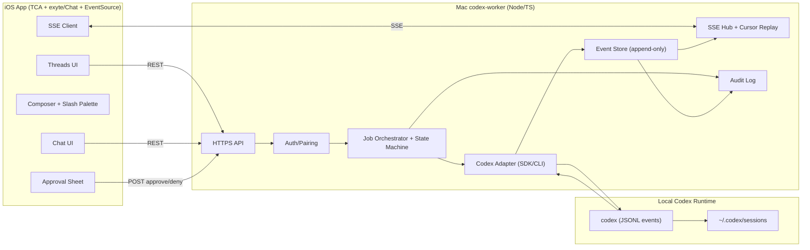
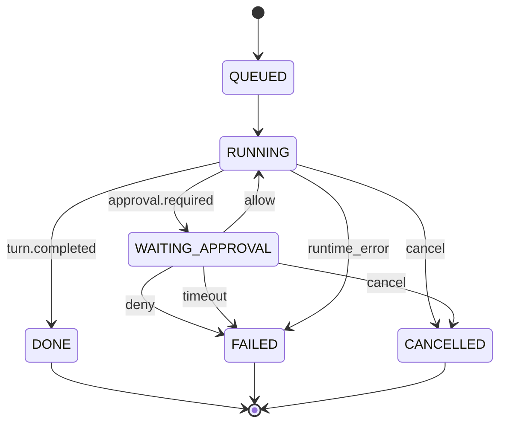
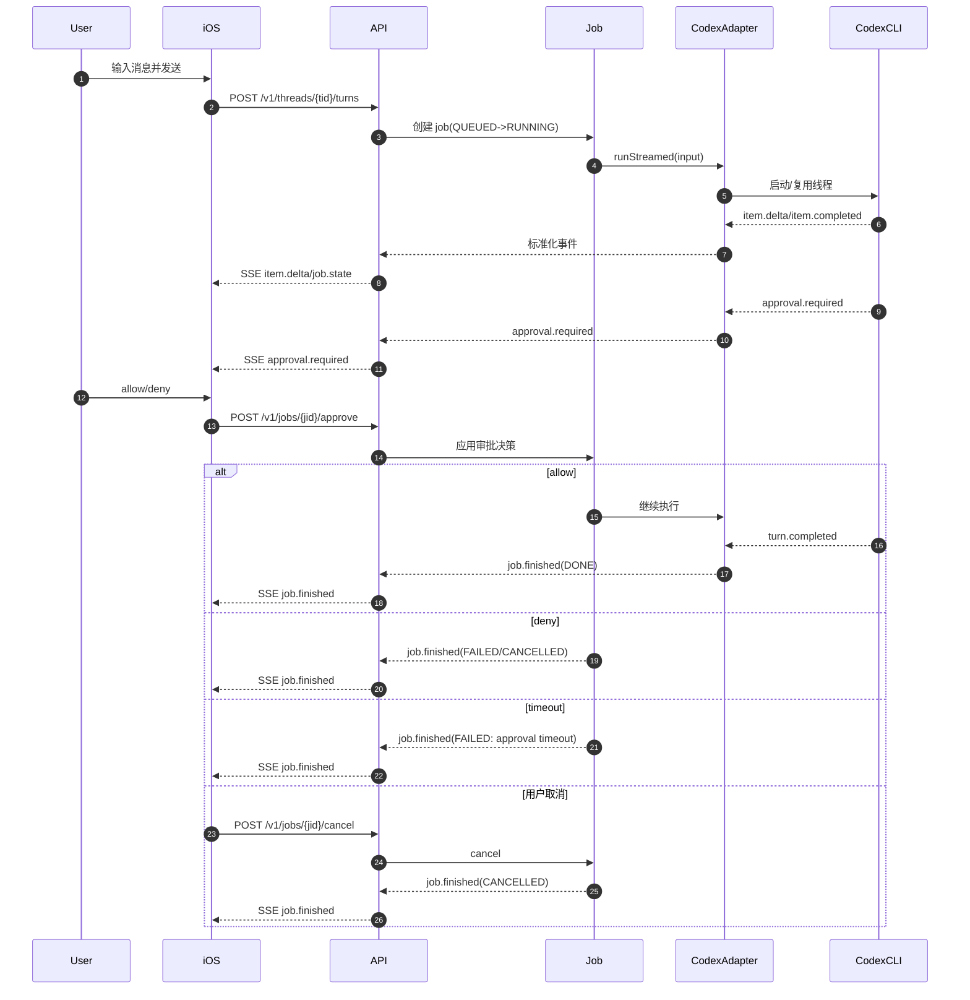

# iPhone 作为前端、Mac 作为 Worker 的 Codex 客户端完整架构（MVP）

> 技术选型：`TCA + exyte/Chat + EventSource`，后续平滑演进到自定义 Markdown/富文本。

## 1. 目标与边界
### 1.1 MVP 目标（必须交付）
- iOS：线程列表/切换、聊天对话、SSE 流式输出、审批弹窗、任务终态展示。
- Mac Worker：7 个核心 API + SSE Hub（cursor 续流）、Job 状态机、Codex Adapter、审计落盘。
- 成功标准：
  - 用户可完成“发消息 -> 看流式输出 -> 收到审批 -> allow/deny -> DONE/FAILED/CANCELLED”闭环。
  - SSE 断线后按 `cursor` 续流，不重跑任务。
  - 审批与关键状态变化可审计、可回放。

### 1.2 明确非 MVP（延后）
- 文件树/文件读取/搜索。
- diff/补丁编辑。
- 远端终端会话。
- Git commit/push/PR 自动化。

## 2. 核心选型与 ADR
### 2.1 iOS 选型（主推组合）
- 状态管理：`TCA`。
- 聊天 UI：`exyte/Chat`。
- SSE 客户端：`EventSource`。

选型原因：
- `TCA` 便于将线程、SSE、审批、任务状态机拆成可测试 Feature。
- `exyte/Chat` 能快速交付消息流 UI，并支持用自定义消息体插入审批卡片/状态卡片。
- `EventSource` 与 `cursor` 续流机制天然匹配，实现简单且可控。

### 2.2 关键约束
- Domain 不绑定 UI 库：`Thread / Message / Job / Approval / EventEnvelope` 作为稳定核心模型。
- iOS 仅消费标准化事件，不直接依赖 Codex 原始 JSONL 字段。
- Worker 负责吸收上游字段变化（Normalizer 适配层）。

## 3. 总览架构图


## 4. 协议稳定层（对 iOS 稳定）
### 4.1 事件 Envelope
```json
{
  "type": "job.created | job.state | turn.started | item.started | item.delta | item.completed | approval.required | job.finished",
  "ts": "2026-02-12T16:00:00Z",
  "jobId": "job_xxx",
  "seq": 42,
  "payload": {}
}
```

### 4.2 审批对象
```json
{
  "approvalId": "appr_xxx",
  "jobId": "job_xxx",
  "riskLevel": "SAFE | RISKY | EXTERNAL",
  "action": {
    "kind": "command | write_file | network | git_push",
    "preview": "string",
    "cwd": "/repo",
    "affectedPaths": []
  },
  "options": ["allow_once", "allow_session", "deny"],
  "createdAt": "2026-02-12T16:00:00Z",
  "expiresAt": "2026-02-12T16:05:00Z"
}
```

### 4.3 Job 状态机（Worker 权威）


规则：
- iOS 不推导状态，只展示 `job.state` 与 `job.finished`。
- `approve(approvalId)` 必须幂等，同一 `approvalId` 重复提交返回首次结果。
- `cancel(jobId)` 对终态无副作用，返回当前终态。

## 5. Worker（Mac）详细设计
### 5.1 模块职责
- API 层：REST + SSE（鉴权、参数校验、幂等保护）。
- Job Orchestrator：一个 turn 对应一个 job，负责状态机、超时、取消。
- Codex Adapter：调用 SDK/CLI，消费 JSONL 事件。
- Event Normalizer：将 Codex 原始事件归一化为 8 类标准事件。
- Event Store（append-only）：`seq` 单调递增，支持 cursor 回放。
- Audit Log：审批、状态迁移、关键错误不可变落盘。

### 5.2 API 契约（MVP 7 个端点）
- `POST /v1/threads` 创建线程。
- `GET /v1/threads` 查询线程列表。
- `POST /v1/threads/{tid}/turns` 发消息并创建 job。
- `GET /v1/jobs/{jid}` 查询 job 快照。
- `GET /v1/jobs/{jid}/events?cursor=N` 订阅 SSE 续流。
- `POST /v1/jobs/{jid}/approve` 提交审批。
- `POST /v1/jobs/{jid}/cancel` 取消 job。

### 5.3 SSE 与 cursor 续流
- Store 持久化所有事件，`seq=0..N`。
- iOS 重连携带最后确认的 `cursor`，服务端只推送 `seq > cursor` 的事件。
- 断线续流不得触发任务重跑，重跑必须创建新 job。

### 5.4 安全与边界
- 默认部署在本机/LAN；公网必须反代 TLS + 强鉴权（mTLS/JWT/短时 token）。
- Worker 不重复实现命令/路径 allowlist，权限边界由 Codex 执行模式与审批暂停机制保证。
- 平台负责鉴权、审批流转、审计追踪，不额外设计第二套权限系统。

## 6. iOS（TCA + exyte/Chat）详细设计
### 6.1 Domain 与 UI 解耦
- Domain 模型：`Thread`、`Message`、`Job`、`Approval`、`EventEnvelope`。
- UI Adapter：`DomainMessage -> exyte.ChatMessage`。
- 迁移策略：后续替换 transcript 渲染时，仅替换 View/Adapter，不改 Reducer 与网络层。

### 6.2 Feature 拆分
- `AppFeature`：全局认证、路由、当前线程。
- `ThreadsFeature`：线程加载/创建/切换。
- `ChatFeature`：消息列表、Job 状态、SSE 流、审批入口、输入框。
- `SSEFeature`：连接、心跳、断线重连、cursor 更新。
- `ComposerFeature`：输入草稿、slash 面板（MVP 先做本地命令列表）。
- `ApprovalFeature`：审批弹窗与 approve/deny 回传。

### 6.3 关键 reducer 逻辑
- `item.delta` 合并到同一条 assistant 消息，禁止每个 delta 新增一条消息。
- `item.completed` 标记流式消息结束，切换到稳定显示。
- `approval.required` 写入 `pendingApproval` 并弹出审批 sheet。
- `job.finished` 统一清理流式上下文并刷新终态卡片。

### 6.4 iOS MVP UI 清单
- 线程列表与切换。
- 聊天消息流（支持流式增量显示）。
- 审批卡（动作预览、风险等级、allow/deny）。
- 任务状态卡（RUNNING/WAITING_APPROVAL/DONE/FAILED/CANCELLED）。

## 7. 请求生命周期（时序）


## 8. 交付计划与 DoD
### 8.1 P0（MVP 必须）
- Worker：7 API + SSE cursor 续流 + 状态机 + 审批幂等 + 审计落盘。
- iOS：Threads/Chat/Stream/Approval 闭环，delta 合并，断线重连。

DoD：
- 主链路从 `POST /turns` 到 `job.finished` 可稳定跑通。
- 审批 allow/deny/timeout 三条分支行为可验证且可回放。
- SSE 断线续流不丢事件、不重跑任务。

### 8.2 P1（体验增强）
- 审批卡、状态卡、错误卡视觉规范统一。
- slash 命令面板（本地命令 + 搜索过滤）。
- Markdown 渲染增强（代码块、引用、列表）。

### 8.3 P2（能力扩展）
- 自绘 transcript（替代 `exyte/Chat`）。
- 富文本输入与结构化文档模型。
- 文件/搜索/diff/终端能力按 roadmap 放开。

## 9. 演进路线（从 exyte/Chat 到富文本）
### 9.1 迁移阶段
- MVP：`exyte/Chat + Markdown 展示 + 纯文本输入 + slash 面板`。
- V1：替换消息区为 `ScrollView + LazyVStack` 自绘 transcript。
- V2：输入区升级为富文本编辑（文档模型驱动）。
- V3：命令块/卡片块（块级结构化内容）。

### 9.2 数据模型前置设计
`MessageContent` 预留多形态：
- `markdown(String)`
- `richDoc([DocNode])`
- `card(CardModel)`

这样可在不改 Reducer 的前提下替换 UI 渲染层。

## 10. 测试与验收场景
1. 正常对话流：最终到 `job.finished(DONE)`。
2. 审批允许：`allow` 后任务继续并完成。
3. 审批拒绝：`deny` 后进入 `FAILED` 或 `CANCELLED`。
4. 审批超时：进入失败终态并返回可读原因。
5. SSE 断线重连：按 `cursor` 续流，不重复执行任务。
6. 幂等：重复提交 `approve/cancel` 不产生副作用。
7. 并发：两个 job 并行运行，事件不串流。
8. CLI 异常：`error` 被标准化后回传前端。
9. 鉴权失败：未授权请求被正确拒绝（401/403）。
10. 审计完整性：关键动作均有日志可追溯。

## 11. 可观测与上线回滚
### 11.1 指标
- Worker：`job_duration`、`approval_wait_time`、`active_sse_connections`、`codex_error_rate`、`event_store_size`。
- iOS：SSE 重连次数、重连耗时、每个 job 的 `seq` 连续性。

### 11.2 上线检查
- API 契约、状态机、事件类型一致性检查通过。
- 鉴权、审批、SSE、审计四条主链路验收通过。
- 指标与错误分类可观测。

### 11.3 回滚触发与动作
- 触发：审批流不可用，或 SSE 丢事件/重复推送导致状态错乱，或 `job.finished` 异常率超阈值。
- 动作：回退到上一稳定 Worker 版本；保留全部事件和审计数据；按 `jobId` 回放故障样本定位根因。

## 12. 风险与缓解
- 风险：Codex/SDK 升级导致事件字段漂移。  
  缓解：维持 Normalizer 适配层 + 契约回归测试 + 版本锁定。
- 风险：审批信息不足导致误批复。  
  缓解：审批卡强制展示 `preview/cwd/riskLevel`，高风险动作二次确认。
- 风险：移动网络波动造成流式体验抖动。  
  缓解：SSE 心跳 + cursor 重连 + delta 合并渲染。
- 风险：UI 框架绑定过深导致后续演进成本高。  
  缓解：坚持 Domain/UI 解耦，`exyte/Chat` 仅作为 MVP 渲染适配层。

## 13. 决策记录（ADR 摘要）
- ADR-001：MVP 仅做聊天 + 批复，文件与终端能力后置。
- ADR-002：iOS 主推 `TCA + exyte/Chat + EventSource`，优先交付闭环和可测试性。
- ADR-003：iOS 只消费标准化事件，Worker 负责吸收 Codex 字段变化。
- ADR-004：所有写操作返回 `jobId`，过程细节统一经 SSE 输出。
- ADR-005：Domain 不绑定 UI 库，允许平滑迁移到自绘 Markdown/富文本。
- ADR-006：权限边界由 Codex 提供，平台负责鉴权、审批流转、审计追踪。
